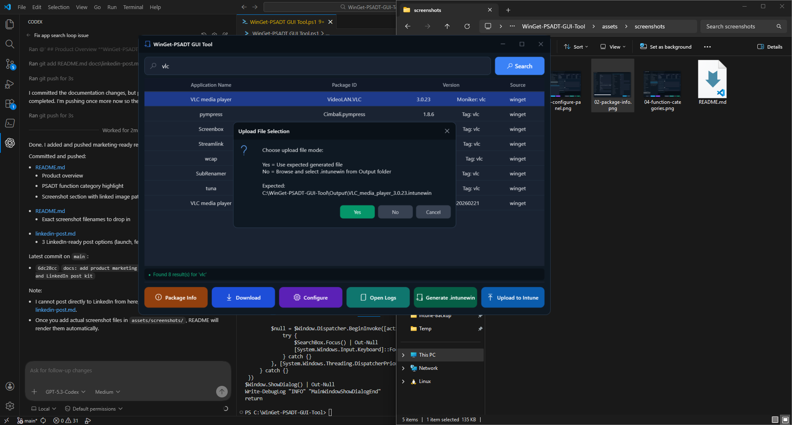

# WinGet-PSADT-GUI-Tool

This repository contains the modularized WinGet + PSADT GUI packaging tool.
**WinGet-PSADT-GUI-Tool** is a Windows PowerShell WPF application that streamlines Win32 app packaging and Intune deployment for IT admins.

It lets you:
- Search apps with WinGet
- Download installers and scaffold a PSAppDeployToolkit (PSADT) package
- Configure install/uninstall/repair logic through a GUI (including categorized PSADT functions and parameters)
- Generate `.intunewin` packages
- Upload directly to Intune with Microsoft Graph authentication
- Apply app metadata and detection rules
- Monitor live operation logs/output during packaging and upload

In short, it turns a multi-step scripting workflow into a guided GUI process while still producing standard PSADT/Intune artifacts.


## Screenshots

### Search Results


### Package Info


### Configure Panel


### Function Categories


### Generate and Upload

## Architecture
Source is split under `src/` in dependency order:
- `Core`
- `Validation`
- `Packaging`
- `Intune`
- `GUI`

## Entry Points
- Main launcher: `WinGet-PSADT-GUI.ps1`
- Full GUI host: `src/GUI/MainHost.ps1`

## Run
Preferred (auto-unblocks local project files once):
```cmd
.\Start-WinGetPsadtTool.cmd
```

PowerShell entry:
```powershell
powershell.exe -ExecutionPolicy Bypass -File .\WinGet-PSADT-GUI.ps1
```

## Prerequisites
- Windows PowerShell 5.1
- WinGet
- PSAppDeployToolkit.Tools: https://github.com/PSAppDeployToolkit/PSAppDeployToolkit.Tools
```Installing The Module
Install-Module PSAppDeployToolkit.Tools -Scope CurrentUser
```
- Microsoft Win32 Content Prep Tool: https://github.com/microsoft/Microsoft-Win32-Content-Prep-Tool

## Prerequisite Placement
Place required external tools/files here before using packaging/upload features:
- `Tools\IntuneWinAppUtil.exe`
- `Templates\Invoke-AppDeployToolkit_Template.ps1` (optional custom template)

If template file is not present, the app uses default PSADT template flow.

## Notes
- Core launcher and GUI host scripts parse successfully.
- Keep `Packages/`, `Output/`, and `Logs/` out of source control.

